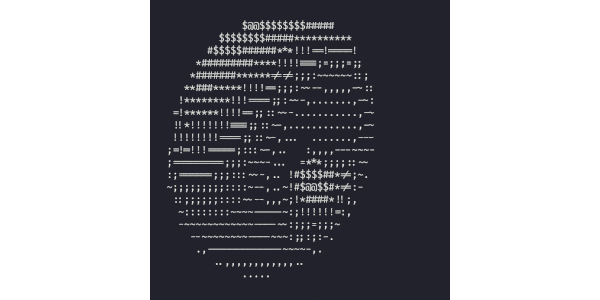

# Hi there 👋, I'm Raffaele

<h3>🎓 Computer Science graduate</h3>
<h3>✨ Strong interest in game development and cybersecurity</h3> 
<h3>⚡ Rust and C++ enthusiast</h3>
<h3>🚀 Open to work on open source projects</h3>

    

  
## My stack🖥

  

